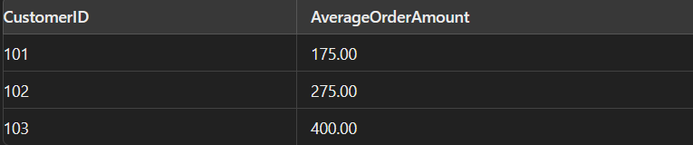

# SQL Challenge Questions

#### Day 1 - 14-08-2024

Each challenge is presented with a description, problem statement, input format, constraints, and output format.

## 🏆 Challenges

### Challenge 1: HR Heroes: Uncovering the Team Members

#### Beginner Level

**Description:**  
Find the names of employees working in a specific department.

**Problem Statement:**  
You have a table named `Employees` with the following structure and data:

| EmployeeID | Name        | Department | Salary |
| ---------- | ----------- | ---------- | ------ |
| 1          | Visagan     | HR         | 50000  |
| 2          | Jane Smith  | IT         | 60000  |
| 3          | Alice Brown | HR         | 52000  |
| 4          | Bob Davis   | IT         | 58000  |
| 5          | Charlie Lee | Finance    | 55000  |

Write a query to find the names of employees who work in the 'HR' department.

**Input Format:**

- `Employees` table with columns `EmployeeID`, `Name`, `Department`, `Salary`.
  

**Constraints:**

- The `Department` field is case-sensitive.

**Output Format:**

- List of employee names working in the 'HR' department.
  

**Tags:** Basic Query, Filtering

---

### Challenge 2: Departmental Dough: Tracking Total Salaries

#### Intermediate Level

**Description:**  
Calculate the total salary expenditure for each department.

**Problem Statement:**  
Using the same `Employees` table from Challenge 1, write a query to find the total salary expenditure for each department.

**Input Format:**

- `Employees` table with columns `EmployeeID`, `Name`, `Department`, `Salary`.
  

**Constraints:**

- Departments may have multiple employees.

**Output Format:**

- Total salary expenditure for each department.
  

**Tags:** Aggregation, Group By

---

### Challenge 3: Customer Cash Flow: Averaging Order Amounts

#### Intermediate Level

**Description:**  
Find the average order amount for each customer.

**Problem Statement:**  
You have a table named `Orders` with the following structure and data:

| OrderID | CustomerID | OrderDate  | Amount |
| ------- | ---------- | ---------- | ------ |
| 1       | 101        | 2023-08-01 | 200    |
| 2       | 102        | 2023-08-02 | 300    |
| 3       | 101        | 2023-08-05 | 150    |
| 4       | 103        | 2023-08-07 | 400    |
| 5       | 102        | 2023-08-09 | 250    |

Write a query to find the average order amount for each customer.

**Input Format:**

- `Orders` table with columns `OrderID`, `CustomerID`, `OrderDate`, `Amount`.
  

**Constraints:**

- Each customer may have multiple orders.

**Output Format:**

- Average order amount for each customer.
  

**Tags:** Aggregation, Group By

---

### Challenge 4: Order Overload: The Quest for the Second Highest Amount

#### Advanced Level

**Description:**  
Find the second highest order amount.

**Problem Statement:**  
Using the same `Orders` table from Challenge 3, write a query to find the second highest order amount.
| OrderID | CustomerID | OrderDate | Amount |
|---------|------------|------------|--------|
| 1 | 101 | 2023-08-01 | 200 |
| 2 | 102 | 2023-08-02 | 300 |
| 3 | 101 | 2023-08-05 | 150 |
| 4 | 103 | 2023-08-07 | 400 |
| 5 | 102 | 2023-08-09 | 250 |

**Input Format:**

- `Orders` table with columns `OrderID`, `CustomerID`, `OrderDate`, `Amount`.
  

**Constraints:**

- Order amounts are unique.

**Output Format:**

- Second highest order amount.
  

**Tags:** Subquery, Ranking

---

### Challenge 5: High Rollers: Identifying Big Spenders

#### Advanced Level

**Description:**  
Find the names of customers who have placed orders worth more than $300.

**Problem Statement:**  
You have two tables, `Customers` and `Orders`, with the following structures and data:

**Customers Table:**

| CustomerID | Name        |
| ---------- | ----------- |
| 101        | Visagan     |
| 102        | Jane Smith  |
| 103        | Alice Brown |

**Orders Table:**

| OrderID | CustomerID | OrderDate  | Amount |
| ------- | ---------- | ---------- | ------ |
| 1       | 101        | 2023-08-01 | 200    |
| 2       | 102        | 2023-08-02 | 300    |
| 3       | 101        | 2023-08-05 | 150    |
| 4       | 103        | 2023-08-07 | 400    |
| 5       | 102        | 2023-08-09 | 250    |

Write a query to find the names of customers who have placed orders worth more than $300.

**Input Format:**

- `Customers` table with columns `CustomerID`, `Name`.
- `Orders` table with columns `OrderID`, `CustomerID`, `OrderDate`, `Amount`.

**Constraints:**

- Orders worth more than $300 are considered.

**Output Format:**

- List of customer names who have placed orders worth more than $300.
  

**Tags:** Joins, Filtering

---
